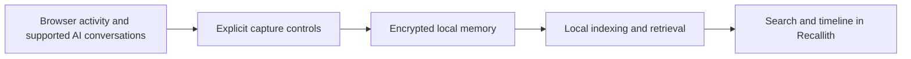

# Mnemolith

[](LICENSE)
[](website/install.html)
[](website/index.html)

Mnemolith is the public home of Recallith, a private memory layer for your digital life. Recallith helps you find browser activity and supported AI conversations you have already seen. Your captured memory stays on your device and remains under your control.

## Demo

The landing-page walkthrough in [`website/index.html`](website/index.html) shows the recall flow. A recorded demo can be added later without changing the application or exposing private data.

## How it works



Recallith combines passive, user-controlled capture with local storage and semantic retrieval. Users can pause capture, exclude sites, inspect their timeline, export eligible data, and delete selected memories.

## Technical highlights

- Local-first storage with encrypted text and OS-managed key material.
- Browser and supported LLM conversation capture with explicit controls.
- Semantic retrieval and natural-language recall through a locally selected model.
- Timeline reconstruction, source-event attribution, deduplication, export, and targeted deletion.
- A desktop deep-link protocol used by the website's **Try it** experience.

## Supported surfaces

| Surface | Public status |
| --- | --- |
| Windows desktop | Public beta release available |
| Chrome/Chromium companion | Supported by the product; source is not published here |
| ChatGPT | Capture supported |
| Claude | Capture supported |
| Gemini | Capture supported |
| Microsoft Copilot | Capture supported |
| Perplexity | Compatibility is tested as the site evolves |
| macOS and Linux | Installation guidance is provisional; packaged releases are not yet published |

## Research background

Recallith explores practical episodic-memory retrieval for personal computing: capturing timestamped activity, preserving source attribution, grouping events into sessions, and retrieving relevant evidence before generating a narrative. The product is designed to make recall useful without turning private history into a cloud dataset.

## Public repository scope

This repository intentionally contains only the public website, brand assets, installation guidance, public documentation, and approved release artifacts. It does **not** contain Recallith's backend, desktop source, browser-extension source, encryption implementation, commercial-license enforcement, signing material, private feature logic, secrets, or user data.

The full backend and application implementation are closed source. This repository is a product showcase and distribution surface, not the complete Recallith source tree.

## Repository layout

```text
.
|-- LICENSE
|-- README.md
|-- release-assets/
|   `-- Recallith-Setup.exe
`-- website/
    |-- index.html
    |-- install.html
    |-- changelog.html
    |-- assets/
    |   `-- mnemolith.svg
    |-- css/
    |   `-- tokens.css
    `-- js/
        `-- deeplink.js
```

## Preview the website locally

From the repository root:

```powershell
python -m http.server 8080 --directory website
```

Then open [http://localhost:8080/](http://localhost:8080/). The **Try it** action invokes the registered `recallith://` desktop protocol. If Recallith does not open, the website falls back to the installation guide and preserves the sample question.

## Installation and releases

- Follow the [installation guide](website/install.html).
- Review the [public changelog](website/changelog.html).
- Download the current Windows installer from [GitHub Releases](https://github.com/bartoszbryg/mnemolith/releases/latest).

## Privacy and security

Never submit API keys, session tokens, license-signing material, private keys, personal memory exports, local databases, or diagnostic evidence containing private activity to this repository.

## License

The materials published in this repository are source-available under the [Business Source License 1.1](LICENSE). Personal, non-commercial use is permitted under the Additional Use Grant. Commercial use requires a separate written license from the licensor. On the Change Date, the licensed work transitions to the Apache License 2.0 as specified in `LICENSE`.
